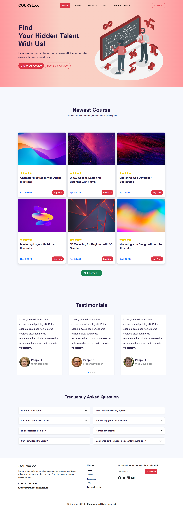

# React Course Website Landing Page

I built this project as a landing page for a fictional company that offers online courses. The goal was to create a visually engaging, responsive, and user-friendly homepage to attract potential customers and encourage them to explore the courses the company provides.

## Tech Stack

- React (Vite)
- Javascript
- Bootstrap
- Animate.css
- Animate on Scroll

## Screenshots

## Appendix

This project was a great way for me to refresh and practice my skills with React, JavaScript, and CSS. It also gave me a chance to experiment with AOS and Animate.css, which were fun to implement and added some nice touch to the overall user experience. Plus, I got to build something that could be used in a real-world scenario (landing pages are everywhere, right?).

## Demo

[Click for Demo](https://react-course-website.vercel.app) or visit react-course-website.vercel.app

